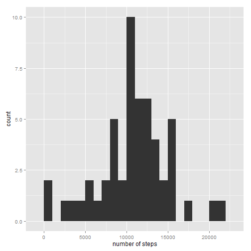
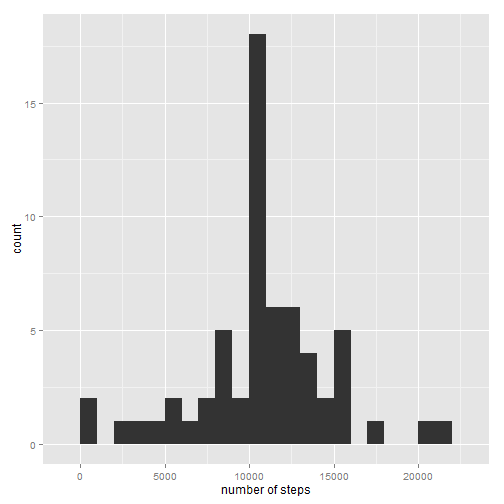
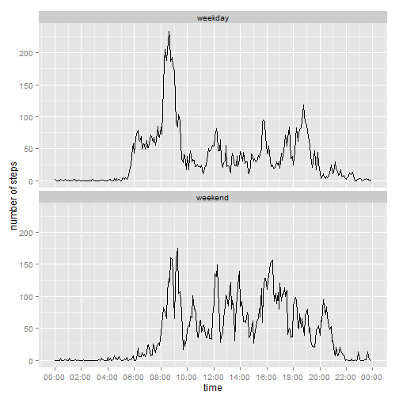

## Loading and preprocessing the data

The code below extracts the activity csv file from the activity folder, loads it into R and converts the 'date' column into POSIXct format.


```r
unzip("activity.zip")
data<-read.csv("activity.csv")
data$date<-as.POSIXct(data$date,format="%Y-%m-%d")
```


## What is mean total number of steps taken per day?

tapply is used to sum the number of steps within each day.

```r
day.sums<-tapply(data$steps,INDEX=data$date,sum)
day.sums.df<-data.frame(date=names(day.sums),steps=day.sums,row.names=1:length(day.sums))
```

Histogram of the total steps per day:

```r
library(ggplot2)
qplot(data=day.sums.df,x=steps,binwidth=1000,xlab="number of steps")
```

 

Calculate the mean and median total steps per day.

```r
day.mean<-mean(day.sums.df$steps,na.rm=TRUE)
day.median<-median(day.sums.df$steps,na.rm=TRUE)
```

The mean total steps per day is 1.0766189 &times; 10<sup>4</sup>.
The median total steps per day is 10765.


## What is the average daily activity pattern?

tapply is used to calculate the mean number of steps for each time interval.The tapply result is inserted into a data.frame with the column "time", which contains the intervals in POSIXct form.


```r
interval.means<-tapply(data$steps,INDEX=data$interval,mean,na.rm=TRUE)
start <- as.POSIXct(x = "00:00", format = "%H:%M")
time<-seq(from = start, by = "5 mins", length.out =288) 
int.means.df<-data.frame(interval=names(interval.means),time,
        steps=interval.means,row.names=1:length(interval.means))
```

Plot of the mean steps over time interval.

```r
library(scales)
ggplot(int.means.df)+
        geom_line(aes(x=time,y=steps))+
        ylab("number of steps")+
        scale_x_datetime(breaks = date_breaks("2 hour"),
                         labels = date_format("%H:%M"))
```

 

Calculate the 5-minute interval with the maximum number of steps:


```r
max.index<-which.max(as.vector(int.means.df$steps))
maxinterval<-format(int.means.df$interval[max.index],format="%H:%M")
```

The interval with the maximum mean steps is 835.


## Imputing missing values

Calculate and the total number of missing values in the dataset:

```r
num.na<-sum(is.na(data$steps))
```
There are a total of 2304 missing values.

Impute the missing values using a loop that tests each observation for missing values. If a missing value is detected the average for that observation's time interval is inserted.

```r
data<-cbind(data,dummy=1:length(data$interval))
data.imp<-data

for(i in data$dummy){
        if(is.na(data$steps[data$dummy==i])) {
                data.imp$steps[data.imp$dummy==i]<-int.means.df$steps[which(int.means.df$interval==data$interval[data$dummy==i])]
        }
        
}

imp.day.sums<-tapply(data.imp$steps,INDEX=data$date,sum)
imp.day.sums.df<-data.frame(date=names(imp.day.sums),steps=imp.day.sums,row.names=1:length(imp.day.sums))
```

Histogram of total steps per day:


```r
qplot(data=imp.day.sums.df,x=steps,binwidth=1000,xlab="number of steps")
```

 

Calculate the mean and median total steps per day.


```r
imp.day.mean<-mean(imp.day.sums.df$steps)
imp.day.median<-median(imp.day.sums.df$steps)
```

The mean number of steps per day is 1.0766189 &times; 10<sup>4</sup>.
The median number of steps per day is `r imp.day.median'.

The mean calculated using imputed values is equal to the mean calculated by removing missing values.


```r
imp.day.mean==day.mean
```

```
## [1] TRUE
```

The median calculated using imputed values is slightly greater than the median calculated by removing missing valuess, and is equal to the mean.


```r
imp.day.median-day.median
```

```
## [1] 1.188679
```

```r
imp.day.median==imp.day.mean
```

```
## [1] TRUE
```


## Are there differences in activity patterns between weekdays and weekends?

'weekdays' function used to create new vector with the day of the week and logic test used to create vector with labels 'weekend' and 'weekday'.


```r
data$day<-weekdays(data$date)
data$day.test<-factor(ifelse(data$day=="Saturday"|data$day=="Sunday","weekend","weekday"))
```

Data subset into two data.frames by week/weekend and tapply is used to calculate the means of each interval for both data sets. Results from tapply were inserted into data.frames and recombined into one dataset.


```r
week<-subset(data,data$day.test=="weekday")
int.means.wk<-tapply(week$steps,INDEX=week$interval,mean,na.rm=TRUE)
weekend<-subset(data,data$day.test=="weekend")
int.means.wknd<-tapply(weekend$steps,INDEX=weekend$interval,mean,na.rm=TRUE)


week.df<-data.frame(interval=names(int.means.wk),time,
           steps=int.means.wk,wkcode=rep("weekday",length(int.means.wk)),row.names=1:length(int.means.wk))
weekend.df<-data.frame(interval=names(int.means.wknd),time,
                    steps=int.means.wknd,wkcode=rep("weekend",length(int.means.wknd)),row.names=1:length(int.means.wknd))
int.means.wkwknd<-rbind(week.df,weekend.df)
```


Plot of week and weekend mean steps by time interval.


```r
ggplot(int.means.wkwknd)+
        geom_line(aes(x=time,y=steps))+
        scale_x_datetime(breaks = date_breaks("2 hour"),
                         labels = date_format("%H:%M"))+
        ylab("number of steps")+
        facet_wrap(~wkcode,ncol=1)
```

 
